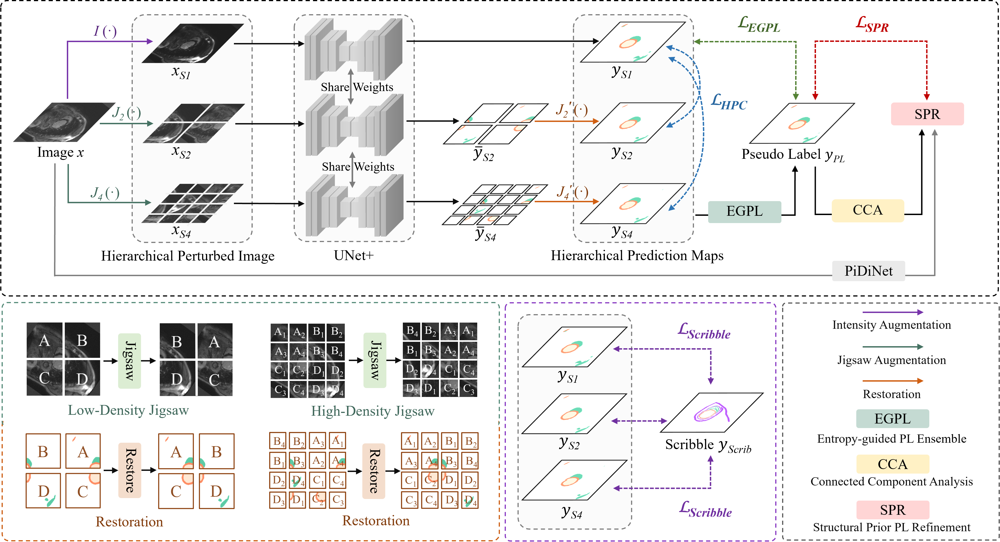

# HELPNet: Hierarchical Perturbation Consistency and Entropy-guided Ensemble for Scribble Supervised Medical Image Segmentation
By Xiao Zhang1, Shaoxuan Wu1, Peilin Zhang, Zhuo Jin, Xiaosong Xiong, Qirong Bu, JingKun Chen*, Jun Feng*. 
(1 Equal Contribution, *Corresponding author)

This project contains the training and testing code for the paper, as well as the model weights trained according to our method HELPNet.

> Creating fully annotated labels for medical image segmentation is prohibitively time-intensive and costly, emphasizing the necessity for innovative approaches that minimize reliance on detailed annotations. Scribble annotations offer a more cost-effective alternative, significantly reducing the expenses associated with full annotations. However, scribble annotations offer limited and imprecise information, failing to capture the detailed structural and boundary characteristics necessary for accurate organ delineation. To address these challenges, we propose HELPNet, a novel scribble-based weakly supervised segmentation framework, designed to bridge the gap between annotation efficiency and segmentation performance. HELPNet integrates three modules. The Hierarchical perturbations consistency (HPC) module enhances feature learning by employing density-controlled jigsaw perturbations across global, local, and focal views, enabling robust modeling of multi-scale structural representations. Building on this, the Entropy-guided pseudo-label (EGPL) module evaluates the confidence of segmentation predictions using entropy, generating high-quality pseudo-labels. Finally, the structural prior refinement (SPR) module incorporates connectivity and bounded priors to enhance the precision and reliability and pseudo-labels. Experimental results on three public datasets ACDC, MSCMRseg, and CHAOS show that HELPNet significantly outperforms state-of-the-art methods for scribble-based weakly supervised segmentation and achieves performance comparable to fully supervised methods.

## Qualitative Results

## Model Weights
The download links and extraction codes for our model weights are as [Checkpoint](https://pan.baidu.com/s/1v8-eGwVZMbvfUczbQEwwaA?pwd=7777)

## Datasets
*  The MSCMRseg dataset with mask annotations can be downloaded from [MSCMRseg](https://zmiclab.github.io/zxh/0/mscmrseg19/data.html).

* Scibble for MSCMR can be downloaded from [MSCMRseg_scribbles](https://github.com/BWGZK/CycleMix/tree/main/MSCMR_scribbles).

*  The ACDC dataset with mask annotations can be downloaded from [ACDC](https://www.creatis.insa-lyon.fr/Challenge/acdc/).

*  Scribble for ACDC can be found at [ACDC_scribbles](https://vios-s.github.io/multiscale-adversarial-attention-gates/data).

*  The CHAOS dataset with mask annotations can be downloaded from [CHOAS](https://chaos.grand-challenge.org/).

*  Scribble for CHAOS can be found at [CHOAS_scribbles](https://github.com/zefanyang/pacingpseudo).

## Requirements
* python 3.8  
* torch 1.12.0 
* numpy 1.24.4 
* medpy 0.5.1 
* nibabel 5.2.1 
* pandas 2.0.3 
* scikit-image 0.21.0 

## Acknowledgement
This repo partially uses code from [CycleMix](https://github.com/BWGZK/CycleMIx) and [ShapePU](https://github.com/BWGZK/ShapePU).
